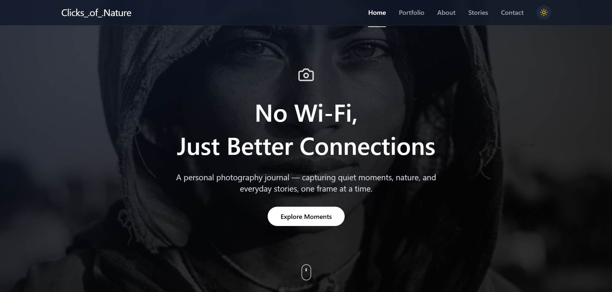

# 📸 Clicks of Nature
*A personal photography journal*

<p align="center">
  
</p>


## 🌿 Overview

**Clicks of Nature** is a personal photography website built as a visual journal rather than a traditional studio portfolio.  
It’s a space to document quiet moments, nature, streets, and everyday stories — captured slowly, thoughtfully, and without rush.

This project focuses on:
- Emotion over perfection  
- Observation over staging  
- Storytelling through still frames  

The website is designed to feel calm, minimal, and human.

---

## ✨ Features

- 🎞️ Journal-style hero section with immersive visuals  
- 🖼️ Portfolio grid with smooth hover interactions  
- 🌗 Dark / Light mode toggle  
- 🎨 Figma-inspired UI implemented in React  
- 📱 Fully responsive across devices  
- 🧩 Graceful image loading with fallback and fade-in animation  
- 🤝 Collaboration section focused on creative alignment  
- 📬 Contact form and clickable social links  

---

## 🛠️ Tech Stack

- **React** (Vite)
- **TypeScript**
- **Tailwind CSS**
- **Motion (Framer Motion)**
- **Lucide Icons**
- **Figma** (design source)

This is a frontend-focused project built primarily for UI, interaction, and storytelling.

---

## 📂 Project Structure

```text
src/
│── components/
│   ├── Header.tsx
│   ├── Hero.tsx
│   ├── Portfolio.tsx
│   ├── About.tsx
│   ├── Collaborate.tsx
│   ├── Contact.tsx
│   └── ImageWithFallback.tsx
│
│── App.tsx
│── main.tsx
│── index.css
